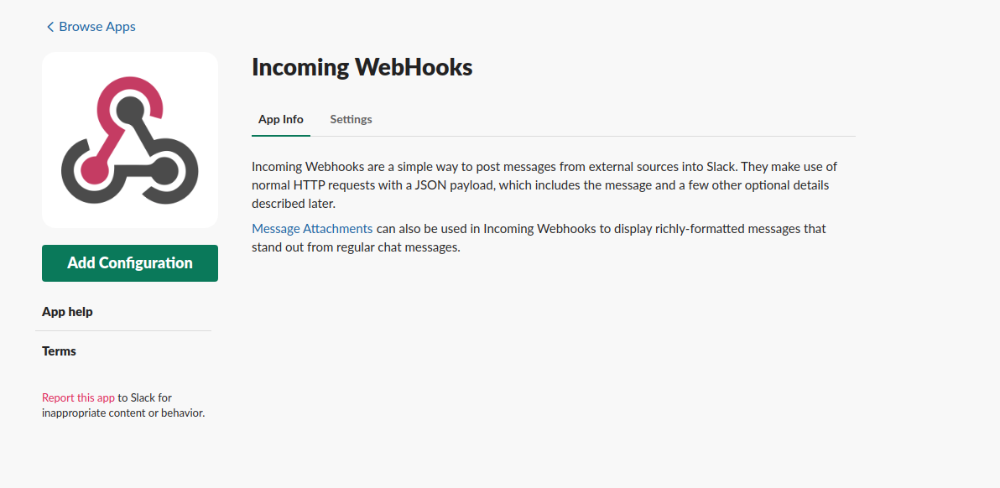
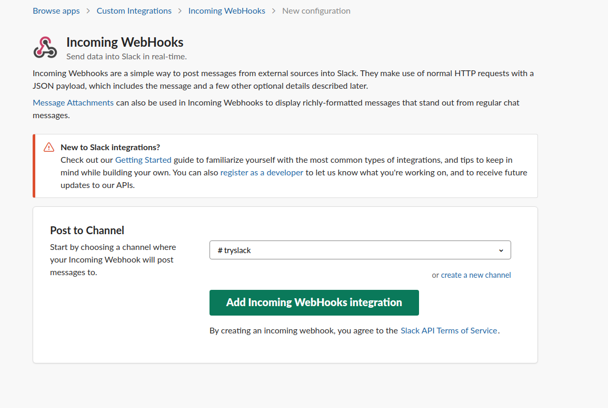
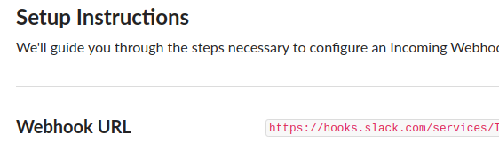
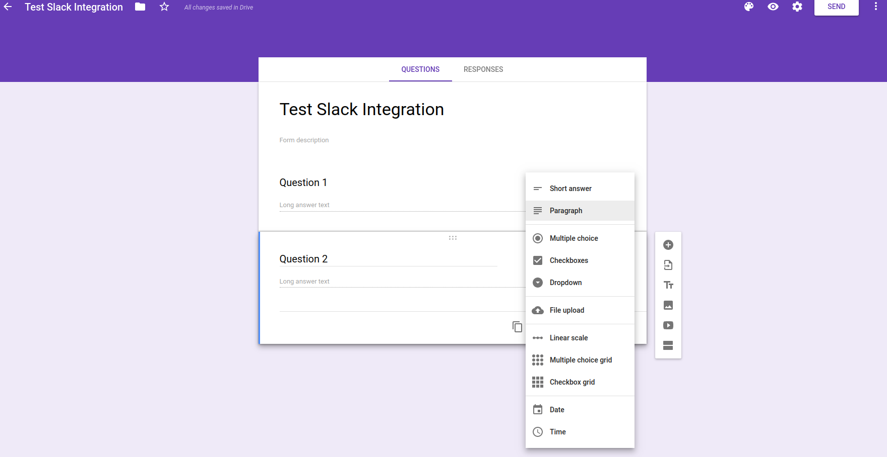
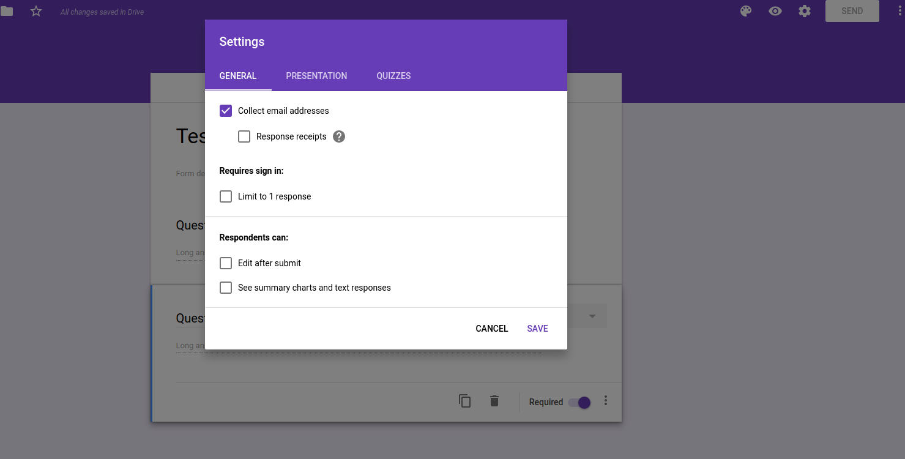
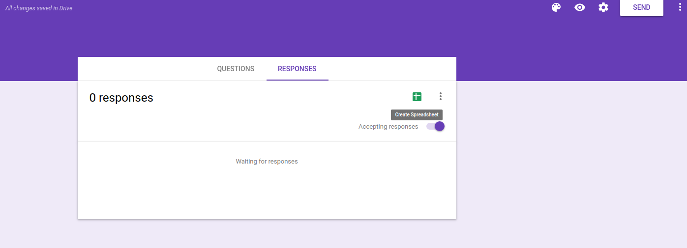
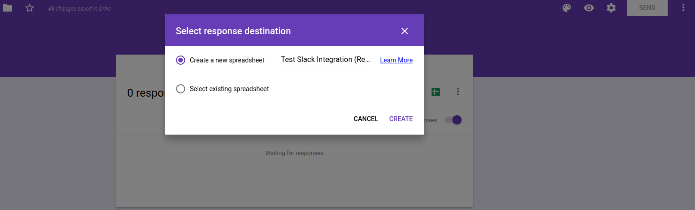
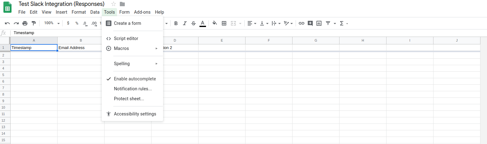
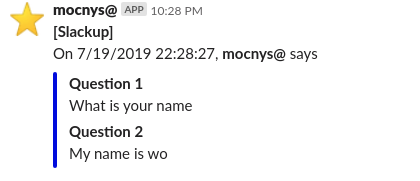

# Google Forms To Slack

Do you have a Google Form? Did you ever wish that you could get a Slack
message when someone submits the Google Form? Great, because that is exactly
what this script does.

## Introduction

- The script [code.js](code.js) is a web service client to the Slack Incoming
  Webhook API; it posts slack messages using HTTP Post.
- This is a Google Apps script. That is, a JavaScript environment that can
  automate Google Drive products such as Google Sheets and Google Forms. It
  also comes with a neat browser based IDE.
  https://developers.google.com/apps-script/

## Setup

You'll need a few things

- An Incoming Webhook integration for your Slack channel. Set this up in
Slack and make note of the URL it provides, you'll need it.
https://api.slack.com/incoming-webhooks
- A Google Sheet attached to your Google Form. The Google Sheet receives data
submitted through the Google Form, and runs a script that sends the received
data to Slack.

### Setup Procedures

- Install the [Incoming-Webhooks](https://api.slack.com/incoming-webhooks)
application to your Slack workspace.

  

- Add a configuration for the application. Select a channel (or create a new channel) to post messages to, and obtain the Webhook URL.

  
  

- Create a new Google Form and add some questions.

  

- Click on the "Settings" button (i.e., the gear-looking button in the upper right corner of the screen), and select the "Collect email addresses" option.

  

- In the "Responses" tab, create a spreadsheet.

  
  

- Open your Google Forms Spreadsheet. In the menu, click on "Tools > Script
Editor".

  

- Paste the [code.js](code.js) script into the Script Editor.

- Edit the code you pasted to include the Slack Incoming Webhook URL in the
customizations block; change the variable `slackIncomingWebhookUrl` and then
set your channel name in the variable `postChannel`. Save.

- Set up the event triggers by running the `initialize()` function. In the
Script Editor's menu bar, select the function `initialize` and click Run.
Agree to any permission requests.

- You're done! Try it out by submitting a response to your Google Form. If
successful, you'll see a new message in your slack channel.

  
